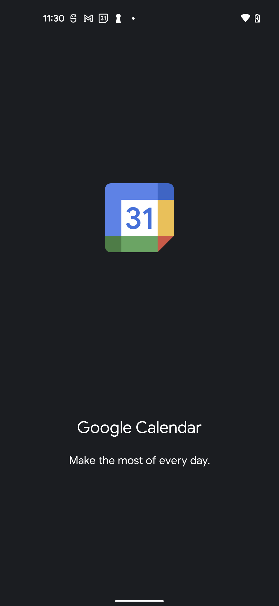
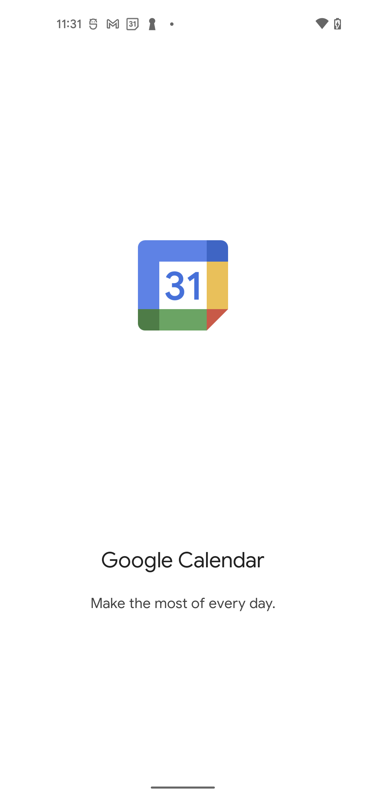
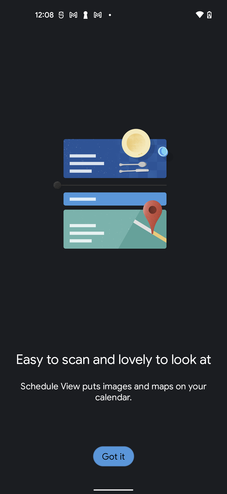
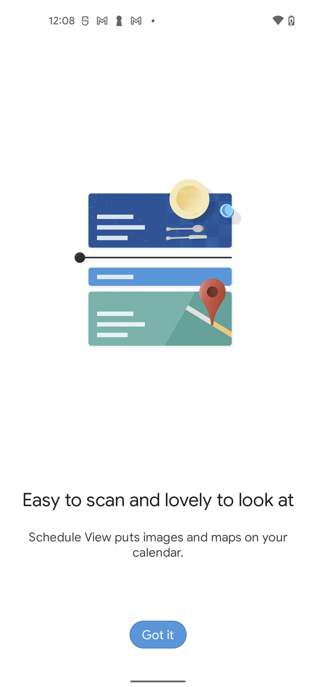
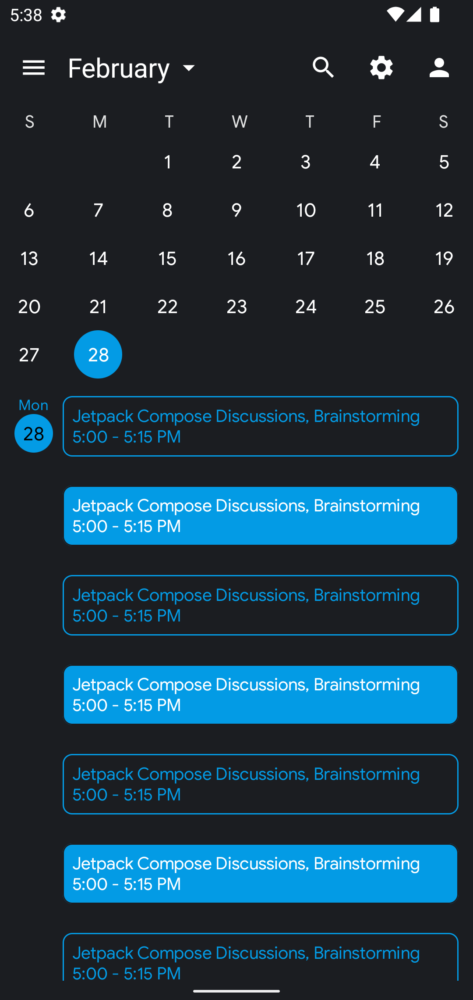
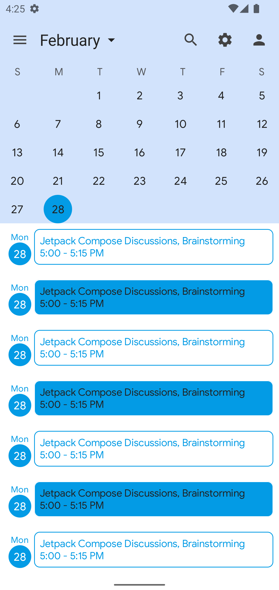
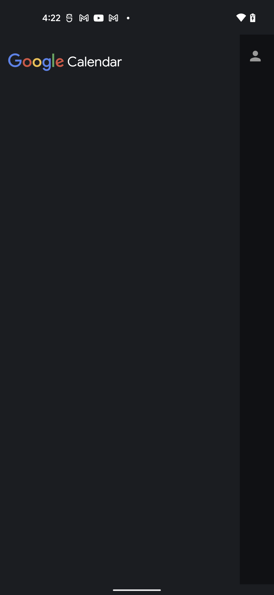
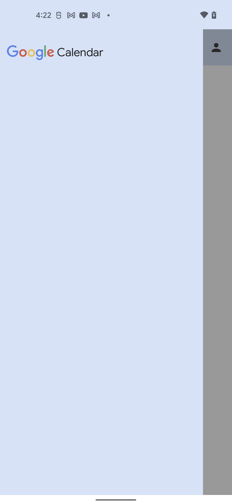

# GoogleCalendar Android Clone with Compose

### Status: WIP

This is a jetpack compose sample app written in Kotlin following clean architecture principles.

The purpose of this app to showcase:

- Implementation of Jetpack Android Architecture components with Dagger Android and Data Binding to
  minimize boilerplate code
- Creation of proper components and Subcomponents using Dagger Android and their injection into
  Activity, Compose Views, View Models and Helper Classes
- Performing background task with Kotlin Coroutines

### Screens
Onboarding Screen 1 Dark            |  Onboarding Screen 1 Light
:-------------------------:|:-------------------------:
  |  

Onboarding Screen 2 Dark            |  Onboarding Screen 2 Light
:-------------------------:|:-------------------------:
  |  

Dashboard Dark(WIP)            |  Dashboard Light(WIP)
:-------------------------:|:-------------------------:
  |  

SideNavigation Dark(WIP)            |  SideNavigation Light(WIP)
:-------------------------:|:-------------------------:
  |  

## 🏗️️ Built with ❤️ using Jetpack Compose 😁

| What            | How                        |
|----------------	|------------------------------	|
| 🎭 User Interface (Android)   | [Jetpack Compose](https://developer.android.com/jetpack/compose)                |
| 🏗 Architecture    | [Clean](https://blog.cleancoder.com/uncle-bob/2012/08/13/the-clean-architecture.html)                            |
| 💉 DI (Android)                | [Hilt](https://developer.android.com/training/dependency-injection/hilt-android)                        |
| 🌊 Async            | [Coroutines](https://kotlinlang.org/docs/coroutines-overview.html) + [Flow](https://kotlin.github.io/kotlinx.coroutines/kotlinx-coroutines-core/kotlinx.coroutines.flow/-flow/)                |
| 🌐 Networking        | [Retrofit](https://square.github.io/retrofit/)                        |
| 📄 Parsing            | [KotlinX](https://kotlinlang.org/docs/serialization.html)                            |

## Languages, libraries and tools used

- [Kotlin](https://kotlinlang.org/)
- AndroidX libraries
- [Android Architecture Components](https://developer.android.com/topic/libraries/architecture)
- [Android Data Binding](https://developer.android.com/topic/libraries/data-binding)
- [Dagger 2](https://github.com/google/dagger)
- [Retrofit](http://square.github.io/retrofit/)
- [Kotlin Coroutines](https://developer.android.com/kotlin/coroutines)

## Architecture

GoogleCalendarClone follows the principles of Clean Architecture with Android Architecture Components.

### Architecture's layers & boundaries:

**UI Layer**  contains  _UI (Activities, Composables, Fragments)_  that are coordinated by  _
ViewModels which execute 1 or multiple UseCases._  Presentation Layer depends on Domain Layer.

**Domain Layer** is the most INNER part of the circle (no dependencies with other layers) and it
contains _Entities, Use cases & Repository Interfaces._ Use cases combine data from 1 or multiple
Repository Interfaces.

**Data Layer**  contains  _Repository Implementations and 1 or multiple Data Sources._  Repositories
are responsible to coordinate data from the different Data Sources. Data Layer depends on Domain
Layer.

**Notes:** Mapping between response models and transformed models will happen via extension
functions defined in transformed model file

### When writing a new ui module

- First, Create a new android library module
- Make sure to copy build.gradle.kts from other ui module and paste it in your ui-module
- We need one fragment to host the composables, this fragment will be added to main nav graph.
- the routing within compose world is handled with Compose Navigator
- and to move out of one ui module you need to use the fragment navigator!

### Conventions:

Files are suffixed with be defined Class types.

- ViewModels are suffixed with **VM**. Ex: `LoginVM`
- UseCases are suffixed with **UseCase**. Ex: `LoginUseCase`
- Sources are suffixed with **Source**. Ex: `LoginRemoteSource`, `LoginLocalSource`
- Repositories are suffixed with **Repo**. Ex: `LoginRepo`

## Conclusion

This project can be used as a template for new apps. This project is continually evolving to
integrate other libraries and techniques to keep it up to date.
